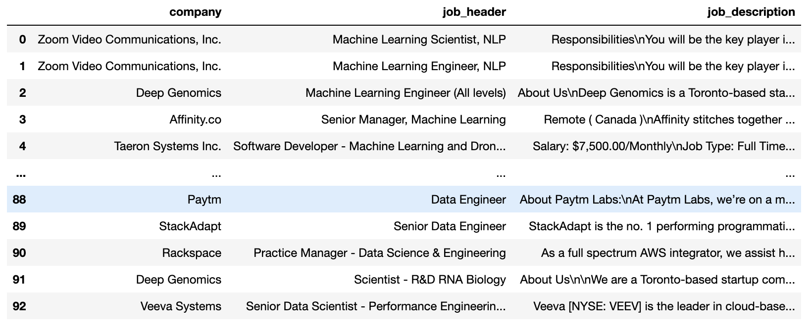

# Indeed Web Scraping Program

Intro
----
Our program extracts three important features for job seekers: 

- Company Name
- Job Header
- Job Description

We use python, selenium and pandas for this program.
When we got the data from the website we save the data as a csv file.
You can type the job and the location as your preference


Run the program
---

```bash
$-> git clone https://github.com/sarperyn/indeed_job_scraping.git
$-> cd indeed_job_scraping
$-> pip install -r requirements.txt
$-> python getIndeed.py #Run program
```
Example of a dataset



